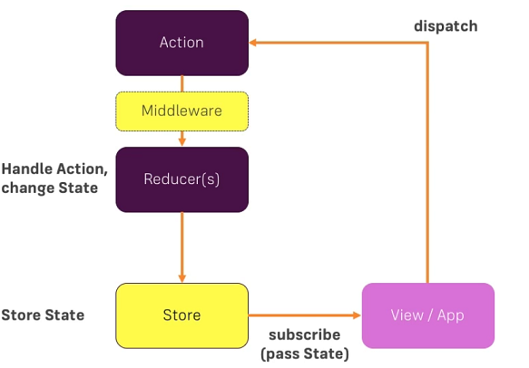
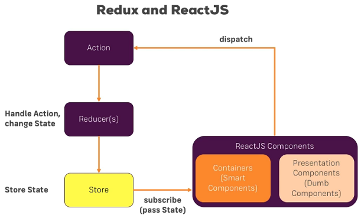

> # Redux full fledged

- Redux is basically a small library like a plugin that we can use with `vanillajs,react,angular,vue` or any other front end framework.
- We will be using `redux` to manage our state in react.
- where our state will be stored in a central location called the `store` so that our other components will be able to access the state.


- In our file we can import create store which lets us create a store .We import using ES6
  ```
  import {createStore} from "redux";
  ```
- ` createStore()` takes in a function i.e `reducer` and a state
- Below is the most basic redux store we can create
  ```
  const hello = () => ('hello');
  const store = createStore(hello);

  //console.log(store);
  console.log(store.getState());
  ```
    

- As you can see the store object from redux has multiple functions that get shipped with it , `dispatch(),subscribe(),getState()` etc
    - _dispatch()_  : dispatches an action to the reducer,thro' an action we could change state
    - _subscribe()_ : looks for changes
    - _getState()_  : gets the current state

## Reducer 
- reducer takes in two arguments `reducer(state,action)`
- We can use a switch case so that we hav multiple options our switch case will always have a `default case which will return the current state`.

## Action 
- `store.dispatch()` the dispatch method is used to dispatch an action to the reducer to perform the necessay function

## State
- Redux doesn't moify the state but creates a new state i.e. it follows the principle of `immutability`

So in a nutshell redux works as follows:
  - We create a store and then tell the store who is responsible for changing the `state(reducer)`
  - We then `dispatch an action` and the dispatched action is `handled by the reducer`
- We should make sure that we are changing the state in a immutable way i.e. take a state object create a copy and return new state so that old state remains untouched

  ```
  case 'ADD' :
          state.result+= action.payload;
          break;
  ```
- But our above approach is not **immutable** cause in the console our

  
- So to achieve **immutability** create a js object in our switch cases and use the spread operator(...) to get the details i.e. properties of our initial state and add them as properties to our new object 
  ```
  case 'ADD' :
          state={
            ...state,
            result:state.result + action.payload,
            lastValues:[...state.lastValues,action.payload]
          };
  ```
  here we want to update the result property

## Multiple Reducers

`import {createStore, combineReducers} from "redux";`
- ES6 destructuring` ({mathReducer,userReducer})`
  ```
  mathReducer:mathReducer
  ```
- So basically we get on big global state that has sub states
 

 ## MiddleWare
 - It allows us to have a function that can be executed in between two function calls
    ```
    a() -->function call
    middleware() -->execute middleware
    b() -->function call
    ```
- In redux the middleware provides a way of doing something in between the point we dispatch the action and the action reaches the reducer

    

- To use middleware import it from redux,
- **A middleware is defined as a function that takes the store as a parameter, returns a function which takes the next middleware as parameter, which in turn returns a function that takes an action to run.**

    ```
    //middleware
    const myLogger = store => next =>action =>{
      console.log('Logged Action',action);
      next(action);
    }; 
    ```
- `next` is basically a method provided by Redux package, if we don't call `next` it won't go to the next function i.e reducer and doesn't reach reducer.

    

 - We can use a logger middleware also 
    ```
     import { createLogger } from 'redux-logger';
    //store
    const store =createStore(combineReducers({mathReducer,userReducer}), {},applyMiddleware(createLogger()));
    ```
    

## React with Redux
    ` yarn add react-redux`
- We can use react-redux as a bridge between react and redux as both are unaware of each other
- To connect react with redux we have to perform following steps so that state is passed from store to react application
    - We use `Provider` which is made available to  us from the react-redux package, to wrap our App (i.e main component) within it. Reason being so that we can pass the store to the App
    - _mapStateToProps_  : is used to specify which properties of the global application `state` do you want to map to the props of the Component or assign to local properties.
    ```
      const mapStateToProps =(state) =>{
        return{
          user:state.user,
          math:state.math
        };
      };
    ```
    we get it from the store
    ```
      const store =createStore(
      combineReducers({math:mathReducer,user:userReducer}),
      {},applyMiddleware(createLogger()));
    ```
    - To make `mapStateToProps()` work we have to use `connect()` which takes in two functions as arguments
    ```
      connect(mapStateToProps,mapDispatchToProps)
    ```
    - _mapDispatchToProps_  : is used to specify which actions we want to use in this component

## Smart & Dumb Components
  
  - Dumb Components aka Presentation Components are not directly connected to Redux and dont know about the state,hence `dumb`
  - Similarly containers are smart as they know about the state

## Asynchronous Actions
- The flow in the program used above is Synchronous by default.
- By default redux provides only synchronous ,to do async actions we can  use `redux-thunk` 
- `redux` returns an object whereas `redux-thunk` returns a function

# Conclusion
- Eventhough this was a simple react-redux application where we did not need to use redux ,it is a practice application to understand the how data flows and how the file would be structured in a big project.